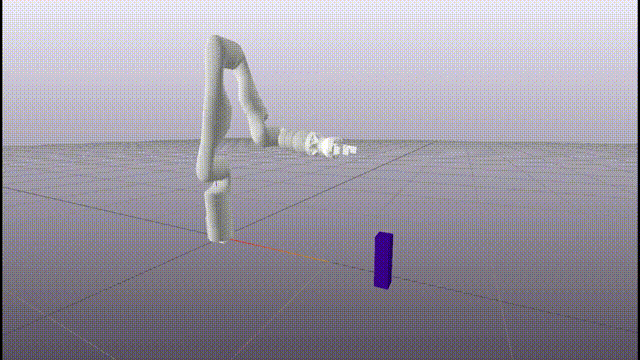
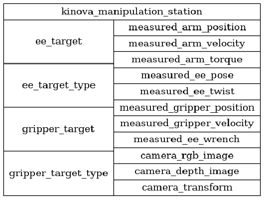

# Kinvoa Drake

Code for controlling a Kinova Gen3 Manipulator via Drake.

|   |   |
|:--------------------:|:------------------:|
| Simulation           | Hardware           |

## Dependencies

- OpenCV
- [Drake](https://drake.mit.edu/)
- [Meshcat](https://github.com/rdeits/meshcat) visualizer
- [Open3d](http://www.open3d.org/docs/latest/introduction.html) point cloud library
- matplotlib
- numpy
- python3
- scipy

Hardware only:

- GStreamer (for accessing camera streams)
- OpenCV with GStreamer bindings
- [Kinova Kortex API](https://github.com/Kinovarobotics/kortex)

## Overview

The goal of this repository is to provide a unified high-level interface with the Kinova 
Gen3 robot arm that is as consistent as possible between real life and simulation.
This is inspired by the 
"[manipulation station](https://github.com/RobotLocomotion/drake/tree/master/examples/manipulation_station)"
provided with Drake, which uses a Kuka iiwa. 

Specifically, we provide a Drake system diagram as follows:



where the same input and output ports are provided in simulation and on the hardware.

## Examples

There are basic examples of various things (both simulation and hardware) in the `examples` directory. These must be run
from this directory with, e.g., `python3 -m examples.peg_pickup_demo`.

### Sending Setpoints

The simplest examples can be run with
```
python3 -m examples.simulation_demo
```
(in simulation) and
```
python3 -m examples.hardware_demo
```
(on the hardware).

These examples demonstrate how to send end-effector position, velocity, or wrench
references. Various parameters can be set such as gripper type, reference type, whether to make system
diagram plots, etc. 

### Peg Pickup Example

The peg pickup examples found in `examples/peg_pickup_demo.py` (simulation) and `examples/peg_pickup_demo_hw.py`
(hardware) show how to use a `CommandSequence` object to design and track a series of setpoints.

Specifically, these setpoints are designed so that the robot reaches and picks up a peg in a known location. 

### Point Cloud Example

Examples of using the robot's depth camera to pick up an object at an a-priori unknown location
can be found in `examples/point_cloud_demo.py` (simulation) and `examples/point_cloud_demo_hw.py` 
(hardware). 

We use a genetic algorithm and a simple geometric heuristic (described [here](http://manipulation.csail.mit.edu/clutter.html))
to select a grasp location. 

Note that you may need to start a meshcat server with, e.g., 

```
bazel run @meshcat_python//:meshcat-server
```
